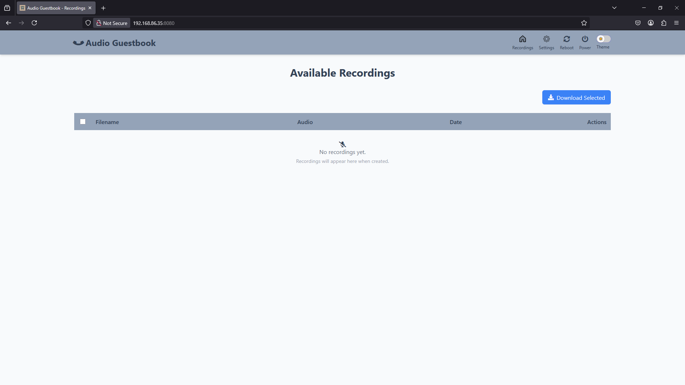
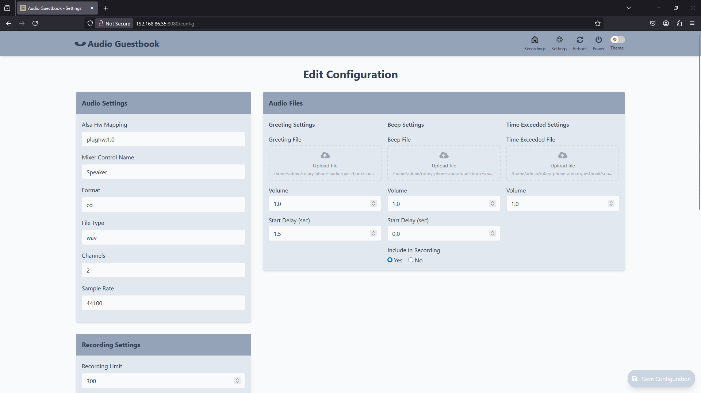

# Wählscheibentelefon Audio Gästebuch

Dieses Projekt verwandelt ein Wählscheibentelefon in einen Sprachrekorder für besondere Anlässe, beispielsweise ein Audio-Gästebuch für Hochzeiten.


- [Rotary Phone Audio Guestbook](#rotary-phone-audio-guestbook)
  - [Background](#background)
  - [Materials](#materials)
  - [Setup](#setup)
    - [Prepare Your Rotary Phone](#prepare-your-rotary-phone)
    - [Download and Install the Custom Image](#download-and-install-the-custom-image)
    - [Ersteinrichtung](#ersteinrichtung)
    - [bei mehreren SSID anmelden](#bei-mehreren-SSID-anmelden)
  - [Software](#software)
  - [Development](#development)
  - [Support](#support)
  - [Star History](#star-history)

## Hintergrund

Inspiriert von der bevorstehenden Hochzeit von Freunden wollte ich mit Hilfe eines Wählscheibentelefons ein selbstgemachtes Audio-Gästebuch bauen. 
Eine gewerbliche Lösung stand nie zur Debatte, ich mag das gern selber zusammen bauen.
Gefunden habe ich dann letztendlich eine Lösung von playfultechnology auf Basis des Teensy +.
Die Hardware war schnell fertig, bei der Software  musste ich viel probieren, bis es endlich funktioniert hat.
Während das Ganze beim ersten Einsatz problemlos funktioniert hat, habe ich es nich für eine weitere Hochzeit zur Verfügung gestellt.
Hier gab es dann immer wieder Probleme mit dem Abspielen der Ansagen und dem Aufzeichnen der Gästenachrichten.

Eigentlich dachte ich, ich versuche es komplett selber zu entwickeln, dann fand ich die Lösung von nickpourazima.
Nachdem mir der Raspberry besser liegt als der Arduino habe ich seine Lösung als Basis genommen und auf meine eigenen Anforderungen umgebaut.
Ich habe bewusst auf Deutsch dokumentiert, um auch die abzuholen, die mit Einglisch nicht so gut zurecht kommen.

## [Material](docs/materials.md)

## Einrichtung

### Telefon vorbereitetn

1. Im Abschnitt [Hardware](docs/hardware.md) findest Du detaillierte Anweisungen zum Anschluss des Wählscheibentelefons an den Raspberry Pi.

_Note: Dies ist ein wichtiger erster Schritt, bevor Du mit der Softwareinstallation fortfahren kannst._

### Herunterladen und Installieren des spezifischen Raspberry-Images 

Wenn die Hardware vorbereitet ist, installiere das benutzerdefinierte Raspberry Pi-Image, das die gesamte erforderliche Software enthält:

1. Lade die aktuellste Version herunter (https://github.com/nickpourazima/rotary-phone-audio-guestbook/releases)
2. Entpacke das .gz file: `gunzip rpizero_rotary_phone_audio_guestbook_v<latest>_imagebackup.img.gz`
3. Flashe das image auf eine SD-Karte (z.B. mnit dem 'Raspberry Pi Imager' oder 'BalenaEtcher':

   

4. Trage die folgenden Anmeldeinformationen ein, wenn die Aufforderung kommt:
   ```bash
   username: admin
   password: password
   ```
5. Richte Die WLAN-Netzwerkverbindung ein
6. Stecke die SD-Karte in den Raspberry Pi und verninde ihn mit der Spannungsversorgung.

### Ersteinrichtung

Sobald die Hardware-Einrichtung abgeschlossen und das Image installiert ist:

1. Starte den Raspberry Pi und warte eine Minute, bis er initialisiert ist.
2. Gebe die Ip-Adresse des Raspi gefolgt vom Port 8000 `<RPI_IP>:8080` in der Adresszeile Deines Browsers ein, um auf das Webinterface zu gelangen:

   

3. Klicke auf die Seite „Einstellungen“, um die Konfiguration anzupassen:

   

Das Audio-Gästebuch ist nun bereit zum Testen/Einsatz! Erweiterte Konfigurationsmöglichkeiten und detaillierte Erklärungen aller Einstellungen findest Du in der [Configuration](docs/configuration.md) Dokumentation.

## [Software](docs/software.md)

## [Entwicklung](docs/development.md)

## Unterstützung

It's great to see this project growing. Special thanks to @svartis, @jmdevita, and @Mevel!

If this code helped you or if you have feedback, I'd be happy to [hear about it](mailto:dillpicholas@duck.com)!
Feel like saying thanks? You can [buy me a coffee](https://ko-fi.com/dillpicholas)☕.

## Star History

<a href="https://star-history.com/#nickpourazima/rotary-phone-audio-guestbook&Date">
 <picture>
   <source media="(prefers-color-scheme: dark)" srcset="https://api.star-history.com/svg?repos=nickpourazima/rotary-phone-audio-guestbook&type=Date&theme=dark" />
   <source media="(prefers-color-scheme: light)" srcset="https://api.star-history.com/svg?repos=nickpourazima/rotary-phone-audio-guestbook&type=Date" />
   
 </picture>
</a>
